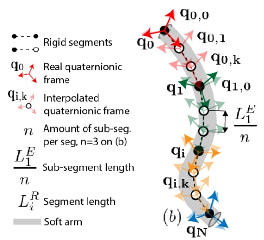
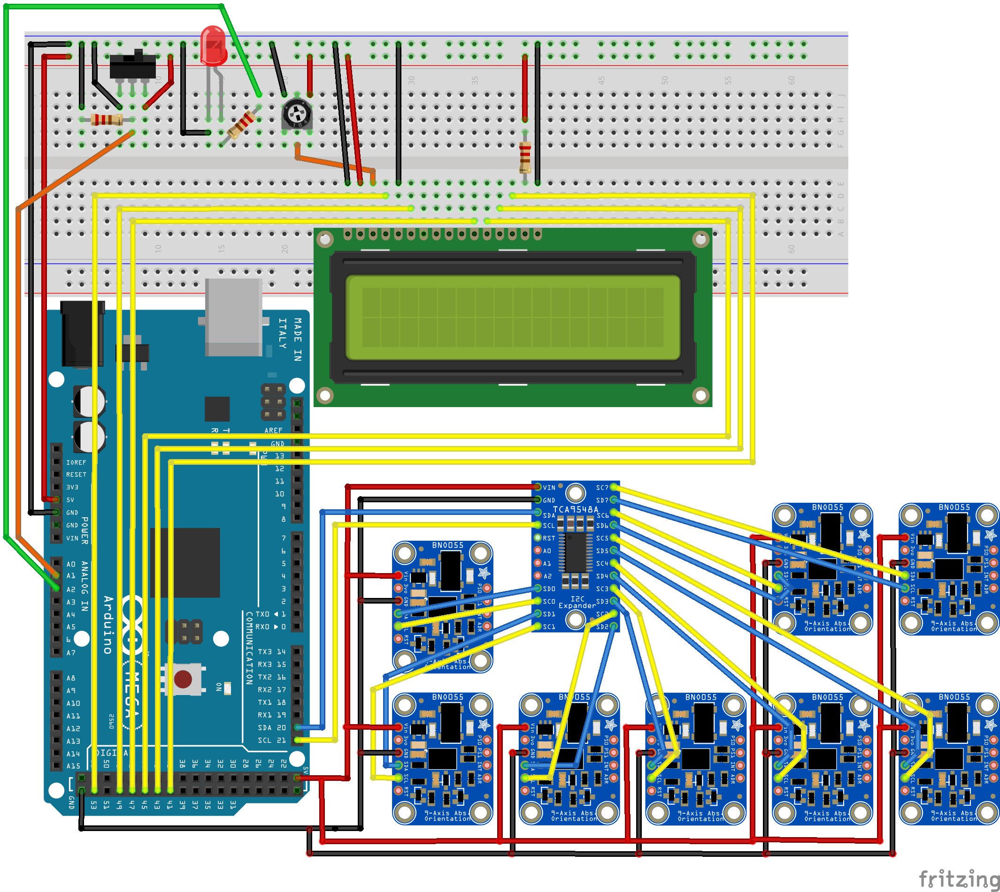
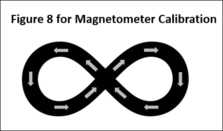
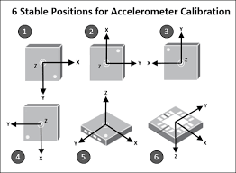
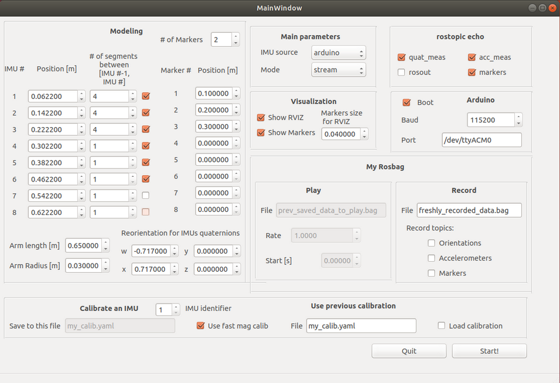

 A soft arm state estimator (SESA) using IMUs
## Goal
This project aims at estimating the state of soft hyperredundant arms using Inertial Measurement Units (IMU) placed along the arm. This repo contains tools to calibrate and stream your IMUs, and to reconstruct the shape based on your custom parameters. A GUI makes the  modeling process more convenient.

## Compatibility
- ROS Melodic
- Ubuntu 18.04

## State estimation method
To estimate the state of the arm, we sense its orientation at each IMU emplacement by reading the corresponding IMU. Then, we model the arm as a series of rigid bodies. Between each IMUs, the arm is cut into a number of rigid bodies set by the user. Each rigid body is oriented using spherical linear interpolation. 



The state estimation method is based on the IROS 2022 paper: "A Proprioceptive Method for Soft Robots Using Inertial Measurement Units", by Yves J. Martin, Daniel Bruder and Robert J. Wood. This paper is stored at the root of this Git repo. 

## Material needed
- 1 to 8 Bosch BNO055 (IMU)
- a I2C Multiplexer (MUX) such as the TCA9548A
- a board Arduino Mega 2560
- a LCD screen such as the E334023
- a potentiometer such as the PDB181-K220K-102B
- a switch such as Mouser's 485-1478

## Key performances
Using 8 IMUs and modeling the arm by 32 rigid bodies:
- the package runs real-time on a P14s Lenovo i7 16Go RAM
- the reading frequency of the IMUs is around 30Hz, but could be improved since the BNO055 output rate is 100Hz.
- the experimentation described in the paper shows around 10% of accuracy if the arm has a piece-wise constant curvature behavior between the IMUs and if the maximum angle between two IMUs is pi/2 rad.

# Repo structure
## SESA Package
This ROS package streams IMUs using I2C protocol and a multiplexer. Then, it estimates the shape of the soft arm and displays it on a RVIZ interface.
## SESA Firmware
Contains the Arduino firmware that is pushed to the Arduino Board. 
## Data processing
A Jupyter Notebook to evaluate the performance of this method w.r.t motion capture (only useful to check the results of the paper).


# Wire up your hardware
Your hardware circuit should look like on the following shematic. Good pratise is to numberize your IMUs from 1 to 8. 




Connect your board to your computer.

# Installation
## Run Ubuntu 18.04 
This package runs on ROS Melodic. It is recommanded to use ROS Melodic on Ubuntu 18.04. 

Ubuntu 18.04 can be downloaded [here](https://releases.ubuntu.com/18.04/).

It can be run as a virtual machine using Virtual Box [here](https://www.virtualbox.org/wiki/Downloads).

## Install ROS Melodic
A tutorial to install ROS Melodic can be found [here](http://wiki.ros.org/melodic/Installation/Ubuntu).

Note: we recommend to create your catkin workspace under the folder `home/[YOUR USER]`.  

## Clone the repo
Clone the repo to your `src/` folder:

```
cd ~/catkin_ws/src
git clone https://github.com/albatrosravageur/State-Estimator-for-Soft-Arm-SESA
```

## Make
Make using the command:
```
cd ~/catkin_ws
catkin_make
```


## Test your installation
As a sanity check, try to run the main launch file.
```
roslaunch sesa my_launch.launch
```

A GUI should appear. Click "quit" to exit.

# Calibration
Each IMU will be calibrated one by one. 

## Run the launcher
```
roslaunch sesa my_launch.launch
```
A GUI should appear.

## Select a configuration using the GUI

### Select calibration mode
Select "calibration" as mode. Check out the top right of the GUI.

### Choose a calibration file 
And write it in the corresponding text line editor. It will be stored in `[path to main folder]/sesa/calibs`. Default is my_calib.yaml.

### Select the # of the IMU that you are calibrating
The calibration attached to this value will be changed in your calibration file.

### Click the arduino boot case
This button will push the calibration firmware directly to the arduino board. You need to click this button when you want to switch mode from stream to calibration and from calibration to stream.

### Set the Arduino port and Baud rate
Select the right port to connect your Arduino board. 
Defaut Baud rate is 115200, but if you change it in the firmware, you have to change it here. 

### Select what topic you want to see 
On the rostopic echo part, you can decide to monitor different topics such as the state of calibration (how well is the calibration done), the calibration itself and rosout. It is recommended to click the state of calibration on.

### You're all set!
You can click the start! button.

## Calibrate the IMU
The IMU has 3 sensors to calibrate, the gyroscope, the magnetometer and the accelerometer. Once the calibration status is 3 for all of the sensors and for the system, you can kill the program. Calibration will be saved in your file automatically.
### The gyroscope
Just keep the IMU still for a few seconds to calibrate the gyroscope.
### The magnetometer
Draw an 8 in the air like shown on this figure.

### The accelerometer
Hold your IMU in different positions such as shown on this figure. 


# TODO streaming


# Nodes
The nodes are launched depending on the configuration, and uses the configuration to run.

The code is modular and adapts to the need of the user: when the user launches the GUI, they can select such or such parameters. This parameters selection is saved as a configuration file, then pushed to `rosparam`.

For example, the user can set the parameter `source` to `arduino`, and then the ROS Serial Arduino node is started. If `source` is set to `rosbag`, the My Rosbag Play node will be launched and will play the file `/my_rosbag/to_play/file`, with a rate `/my_rosbag/to_play/rate` and starting at time `rosbag/to_play/start`.

The nodes here will be described in detail one by one. The estimator models the imu using the quaternions measurements. The save calibration node saves the calibration state pushed to the parameters by the Arduino board. 

## Estimator
### About
This node is started if `mode` is `stream`. It streams the quaternions from `/quat_meas`. If `rviz_gui` is true, estimator publishes to `/robot_state_publisher` the state of the robot, showing the markers positions with green balls. If `topic/markers` is true, estimator publishes the markers positions on `/markers`. The node is written in /sripts/sesa/estimator.py.

### Parameters used
- imus
  - amount
  - enabled
  - offset_quaternion
  - positions
- markers
  - amount
  - enabled
  - positions
  - radius
  - show
  - use
- segments
- rviz_gui

## Save calibration
### About 
This node is started if `mode` is `calibrate`. It streams the calibration state pushed in the parameters by the arduino board, and saves it to the file `calib/calibrate_file`.
The node is written in /sripts/sesa/save_calibration.py

### Parameters used
- calib
  - calibrate_file
  - id
  - use_fast_mag

## ROS Serial Arduino
### About 
This node is started if `source` is `arduino`. If `mode` is `calibration`, `source` is automatically set to `arduino`. This node handles the Serial communication with the Arduino board. This node is using the `serial_node.py` script of the public `rosserial_arduino` package.

### Parameters used
- Arduino
  - baud
  - port

## Visualization (RVIZ)
### About
This node is started if `rviz_gui` is true and if `mode` is `stream`. The ROS package `rviz` is launched and displays the arm state in real time through a visual interface. It uses the robot description `/robot_description`  created under the urdf format using the source file `/src/make_my_urdf.py` during the launch.

### Parameters used
- robot_description

## My rosbag play
### About
This node is started if `source` is `rosbag` and `mode` is `stream`. It is based on the ROS Package `rosbag` and it plays the quaternions stream of a previously recorded experiment into the `/quat_meas` topic from the file `/my_rosbag/to_play/file`. 

### Parameters used
- my_rosbag
  - to_play
     - file
     - rate
     - start

## My rosbag record
### About
This node is started if `source` is `arduino` and `mode` is `stream`. It is based on the ROS Package `rosbag` and it records the quaternions stream of the `/quat_meas` topic into a file `/my_rosbag/to_record/file`. 

### Parameters used
- my_rosbag
  - to_record
    - file
    - accelerometers (bool)
    - markers (bool)
    - quaternions (bool)

# Launch process
The ROS package SESA is launch through a unique launch file, called `my_launch.launch`. A specific configuration file can be used, and then must be entered as an argument through the command line when launching the package, as shown below. The configuration file must be in the `/config` folder.

```
cd ~/catkin_ws
roslaunch sesa my_launch.launch config_file:="[YOUR CONFIG FILE NAME]"
```

Then, the following GUI appear:


Through this GUI, the user can change the configuration to fit the needs of its experiments. Here is a review of the different parameters that can be set through the GUI and how they could help you using this package.

## Main parameters:
- IMU source: can be `arduino`, `rosbag` or `no source`, corresponds to the source for the quaternion stream publiscation in `/quat_meas`. If `arduino`, the ROS Arduino node will be launched and the arduino board will stream the IMUs. If `rosbag`, the source will stream the bag described in the part My Rosbag/Play. If `no source`, the package assumes that an external package will publish to the topic `/quat_meas`.  
- Mode: `stream` or `calibrate`. If mode is `stream`, the package will read the topic `/quat_meas` and estimate the state of the soft arm described in the part "Modeling". If the mode is `calibrate`, the package will read the calibration state published in `rosparam` by the Arduino board, and save it into the file indicated under ther "Calibrate an IMU" title. When changing the mode, you MUST tick the "Boot" option on the Arduino panel to update the firmware on the board.
 
## Modeling 
- IMUs
This part decribes what your robot is like, and how you want to model it. This package models soft arms by rigid-bodies, see the part II-B of roprioceptive_Methods_for_Soft_Robots_using_Inertial_Measurement_Units.pdf at the root of this repo for more information. The IMU \# corresponds to 1+ the \# of the port of the IMU on the I2C MUX. For example, if your IMU is plugged in the port 1 on the I2C MUX, it corresponds to 2 on the GUI and on any output of the package. 
  - position: the position of the IMU along the arm, starting by where you place your origin (usually, the base of your arm). Positions must be sorted increasingly.
  - \# of segments: the number of rigid bodies by whose you want to model the arm between this IMU and the previous one. In the specific case of the IMU 1, it corresponds to the distance between the base and the IMU 1. 
  - enable (the checkboxes on the right): whether this IMU is used or npt. For example, if you use 5 IMUs on your experiment, you should have 5 checkboxes ticked.

- Markers
The markers correspond to points that you want to track along the arm. For example, if you wanted to test the accuracy of this state estimation method, you would write the position of your markers in this column.
  - position: the position of the markkers. You need to fill them from the top to the bottom, and to sort them by increasing order. 
  - \# of markers: the overall amount of markers that you want to use.

- Re-orientation for IMUs quaternions: every quaternion read by the estimator will be multiplied by the left by this quaternion. The goal is to place the IMU with the most convenient orientation along the arm, and then you mathematically reorientate it. To do this, the reorientation quaternion must be the [conjugate](https://en.wikipedia.org/wiki/Quaternion#Conjugation,_the_norm,_and_reciprocal) of the quaternion that you sense when your IMU is fixed on your soft arm and that this arm is standing straight.
  - Arm length: the length of the arm's spine in m.
  - Arm radius: the radius of the arm in m.

## Visualization
This part contains parameters for the visualization RVIZ of the soft arm state estimation.
- show RVIZ: show or not the arm estimation through the RVIZ package
- show markers: show or not the markers on the RVIZ interface
- markers size for RVIZ: the markers are represented by green balls, whose radius can be set in meters there. 

## Rostopic echo
If you tick the box, the package will open a new terminal and echo the topic.

## Arduino
This part contains parameters related to the Arduino board. 
- Boot: tick this box to push the firmware corresponding to the selected mode to a connected Arduino Mega 2560 board. 
- Baud: the baud rate that you want to use to connect to the board. IMPORTANT: if you change the baud rate on the GUI, YOU ALSO NEED TO CHANGE IT ON THE FIRMWARE. The firmware is stored in `/ros_packages/sesa_firmware/arduino/scripts/`.
- Port: the port on which the board is connected. 

## My Rosbag
My rosbag can be used in `stream` mode only. The play part can only be used if the source is `rosbag`.
### Play
This part contains parameters to read recorded quaternions from a stored .bsg file and to publish them to `/quat_meas`.
- file: the .bag file stored in `/ros_packages/sesa/saved/bags/` to read
- rate: the reading rate (publication speed w.r.t the recorded speed).
- start: the time at which to start in seconds.

### Record
This part contains parameters to record a stream of quaternions, accelerometers and markers. 
- file: the name of the .bag to which the data should be saved. This bag is stored in `/ros_packages/sesa/saved/bags/`.
- Orientations: record orientation, i.e the `/quat_meas` topic.
- Accelerometers: record accelerometers, i.e the `/acc_meas` topic.
- Markers: record markers, i.e the `/markers` topic.

## Calibration 
This part contain parameters to calibrate your IMUs, and to load a previous calibration to your IMUs. 
### Calibrate an IMU
This part can only be used in `calibration` mode. 
- IMU identifier: the \# of the IMU that you want to calibrate. This corresponds to 1+the \# of the port on the I2C MUX.
- File: the file to which to want to add the calibration for this IMU. A file contains calibrations for the 8 IMUs. When the `calibration` mode is used, only the calibration corresponding to your IMU number is modified. If you want to calibrate all of your IMUs and to save it into the same file, you need to keep the same file and just to change the IMU number as you calibrate all of your IMUs.

### Use previous calibration
This part helps you load a previous calibration into the IMUs. This is useful since there's no EEPROM on the IMUs, so the calibration isn't saved as you unplug the IMUs. Plus, calibration takes a while. 
- Load calibration: load calibration into `rosparam`. Arduino will read it from there.
- file: the file you want to load calibration from. It has to be stored in `/ros_packages/sesa/calibs/`.


